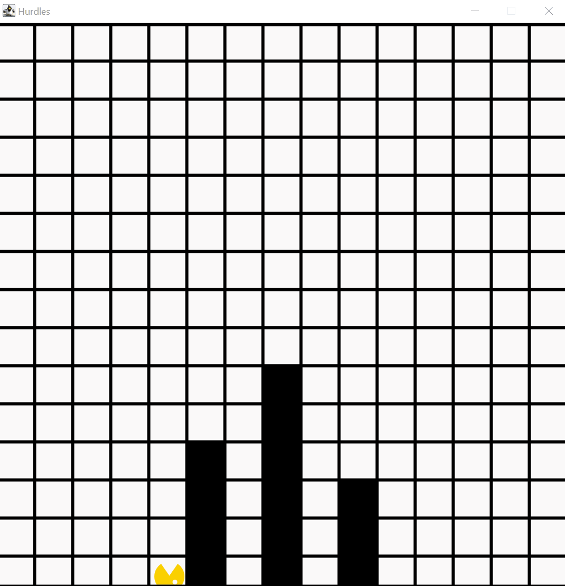

# Hurdles

Bouncer klettert in diesem Beispielprogramm über drei Hürden. Zu Beginn befindet er am unteren Kartenrand in einem beliebigen Abstand zu dem ersten Hindernis. Zwischen den einzelnen Hindernissen befindet sich jeweils genau ein freies Feld. Die Hindernisse sind ein Feld breit und können beliebig und unterschiedlich hoch sein. Zwischen der Spitze der einzelnen Hindernisse und des oberen Kartenrands muss dabei mindestens ein Feld frei sein. Bouncer klettert über alle Hindernisse und bleibt hinter dem letzten der drei Hindernisse stehen.

## Relevante Bezüge zum OOP-Kurs

Anhand dieses Beispiels kann die systematische Analyse und Lösung eines ersten, komplexeren Problems demonstriert werden. Zur korrekten Lösung der Aufgabenstellung muss das Überklettern der jeweils unterschiedlich hohen Hindernisse durch einen passenden, allgemeinen Algorithmus umgesetzt werden. Diese Teillösung muss dann wiederholt ausgeführt werden, um das Gesamtproblem zu lösen. Das währende der Problemanalyse bzw. der Dekomposition des Ablaufs in einzelne Methoden gewonnene Prozesswissen kann zur (vorgehenden) Beschreibung von Vor- und Nachbedingungen für die ausgelagerten Methoden verwendet werden.

- Struktureller Aufbau und Verwendung eines Bouncer-Programms
- Verwendung von Schleifen (`for`) zur kontrollierten Wiederholung von Befehlen
- Verwendung von Schleifen (`while`) zum Erreichen eines gewollten Weltzustands
- Dokumentation von Vor- und Nachbedingungen für Methoden